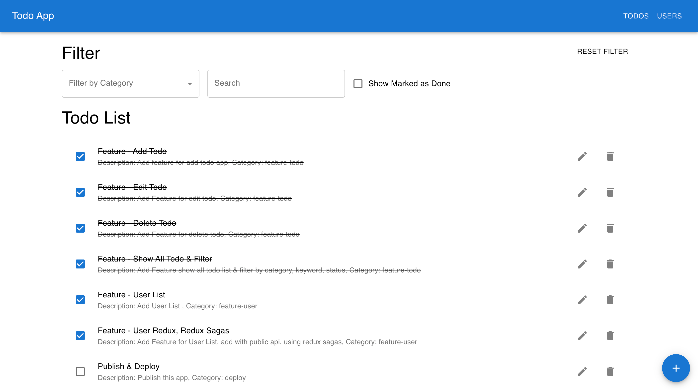
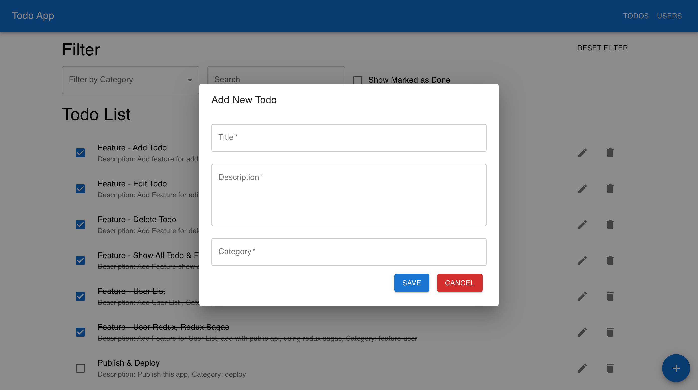
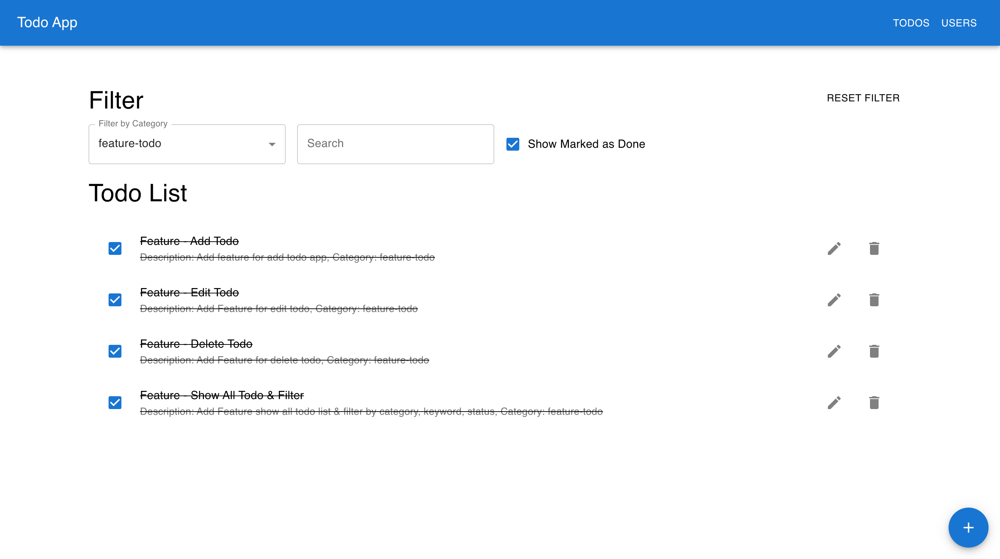
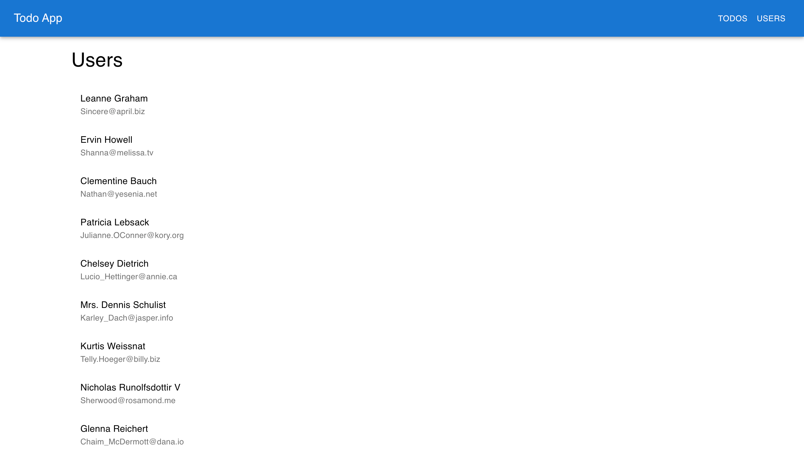

# Welcome to Todo App!
Todo List App is frontend for CRUD Todo using redux and feature Users with redux sagas

## Preview
[](list-fill.png)
[](add-todo.png)
[](filter-category.png)
[](users-public-api.png)

### Currently includes:
- [Demo App](https://vercel.app)
- React JS
- Redux Toolkit
- React Redux
- Redux Sagas
- MUI / Material UI

### Instalation
```$ git clone https://github.com/M-Julius/todo-list-app.git```

```$ cd todo-list-app```

```$ yarn install```

```$ yarn start```
